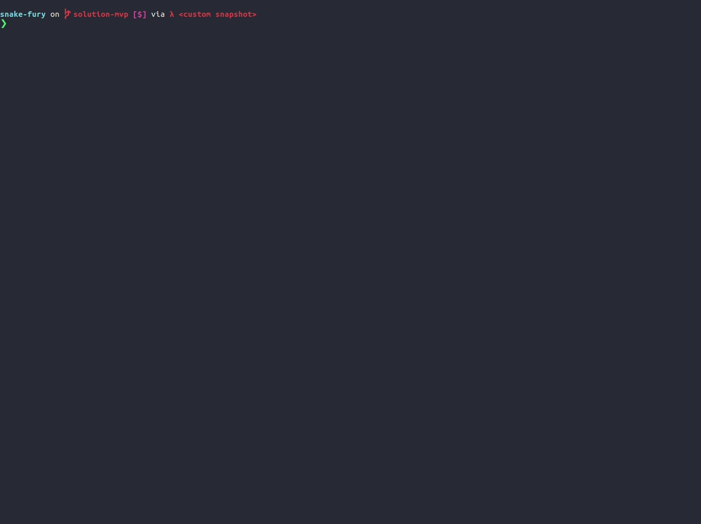

# snake-fury

Snake game written in Haskell. The idea is to learn Haskell with an actual challenge instead of writing the basic 
recursion examples that you can find everywhere (fibonacci numbers...)

![Refactor 1][./assets/game.jpg]

## Original repository
[Ismor Snake Fury](https://github.com/lsmor/snake-fury)

